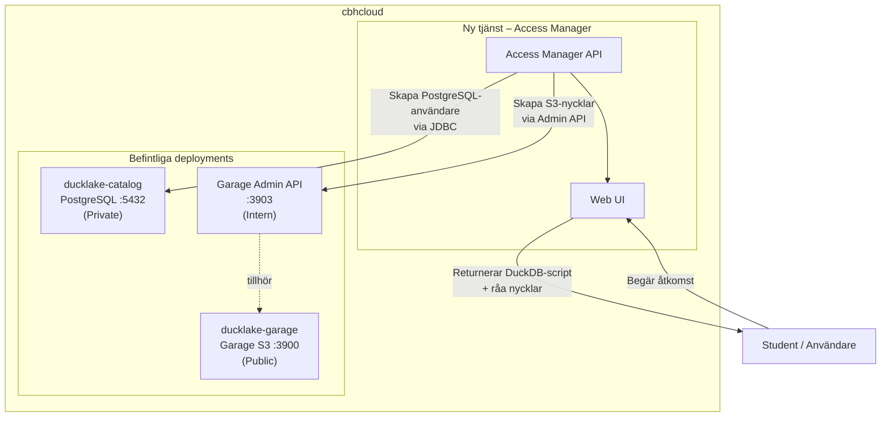
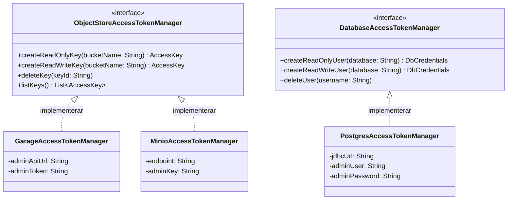
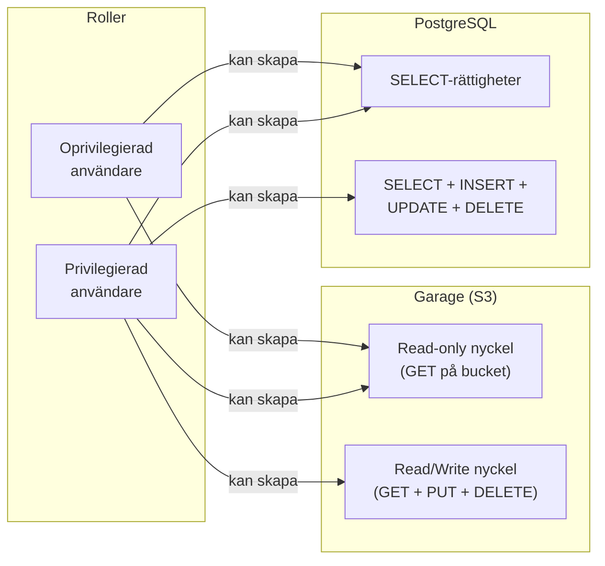
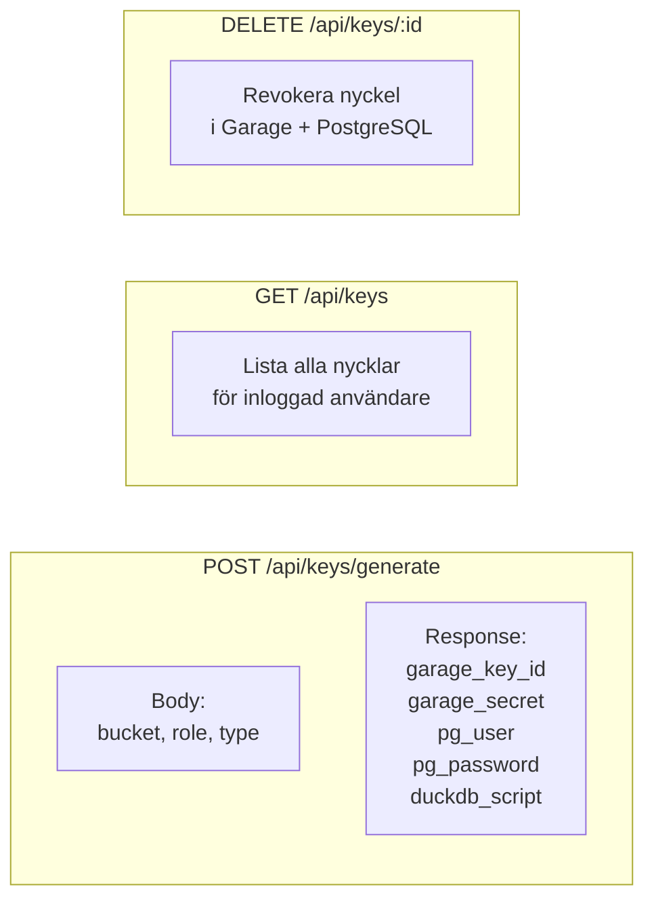
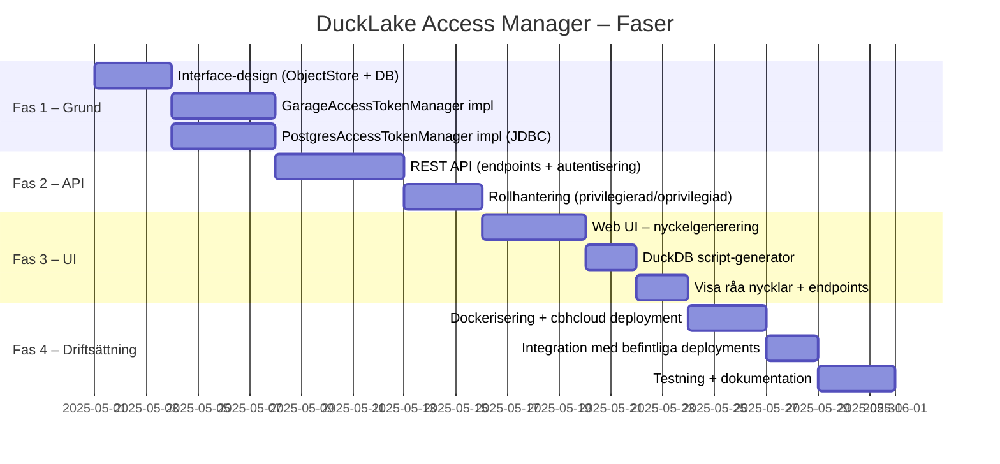

# DuckLake Access Manager – Projektplan

Tjänst för automatisk generering och hantering av åtkomstnycklar till DuckLake (PostgreSQL + Garage) på cbhcloud.

---

## Nuläge

Tre befintliga repositories utgör grunden:

| Repository | Syfte |
|---|---|
| `garage-cbhcloud-quickstart` | Guide för att driftsätta Garage på cbhcloud |
| `ducklake-guide-garage` | Tutorial: PostgreSQL + Garage + DuckDB via SSH-tunnel |
| `ducklake-connect` | Python-klient som ansluter till DuckLake |

**Problemet:** Åtkomstnycklar genereras och delas ut manuellt. Det ska automatiseras.

---

## Övergripande arkitektur



---

## Komponentdesign



---

## Åtkomstregler



---

## API-endpoints



---

## Implementationsplan



---

## Output till användaren

När en nyckel genereras får användaren ett klart-att-köra DuckDB-script:

```sql
INSTALL ducklake;
INSTALL postgres;

LOAD ducklake;
LOAD postgres;

-- Genererat av DuckLake Access Manager
CREATE OR REPLACE SECRET (
    TYPE postgres,
    HOST '<postgres-host>',
    PORT 5432,
    DATABASE ducklake,
    USER '<generated-pg-user>',
    PASSWORD '<generated-pg-password>'
);

CREATE OR REPLACE SECRET garage_secret (
    TYPE s3,
    PROVIDER config,
    KEY_ID '<generated-garage-key-id>',
    SECRET '<generated-garage-secret>',
    REGION 'local',
    ENDPOINT '<garage-endpoint>',
    URL_STYLE 'path',
    USE_SSL false
);

ATTACH 'ducklake:postgres:dbname=ducklake' AS my_ducklake (
    DATA_PATH 's3://<bucket-name>/'
);

USE my_ducklake;
```

Samt råa värden för användare som vill integrera på annat sätt:

| Nyckel | Värde |
|---|---|
| Garage Endpoint | `https://...` |
| Garage Key ID | `...` |
| Garage Secret | `...` |
| PostgreSQL Host | `...` |
| PostgreSQL User | `...` |
| PostgreSQL Password | `...` |

---

## Teknisk stack (rekommendation)

| Del | Teknologi | Motivering |
|---|---|---|
| Backend/API | **Go** | Passar Garage Admin API, lätt att containerisera, används av garage-webui |
| Alternativ backend | **Java (Spring Boot)** | JDBC-stöd inbyggt, välkänt för PostgreSQL-hantering |
| Frontend | **TypeScript + React** | Samma stack som garage-webui för inspiration |
| PostgreSQL-hantering | **JDBC** (Java) eller `database/sql` (Go) | Direkt användarskapande |
| Garage-hantering | **REST API mot :3903** | Officiell admin API, OpenAPI-spec tillgänglig |

---

## Viktiga noter

- **Använd interfaces** – `ObjectStoreAccessTokenManager` och `DatabaseAccessTokenManager` – så att MinIO enkelt kan bytas mot Garage (eller vice versa) utan att ändra resten av systemet.
- **MinIO är unmaintained** – bygg primärt `GarageAccessTokenManager`, lägg till MinIO-impl endast om det behövs för lokal dev.
- **Garage Admin API port 3903** – måste vara nåbar från Access Manager-tjänsten internt på cbhcloud.
- **Olika datasets = olika buckets** – hantera behörigheter per bucket, inte globalt.
- **PostgreSQL utan SSH-tunnel** hanteras av handledaren som en systemtjänst via Helm chart – detta är inte vår uppgift.
